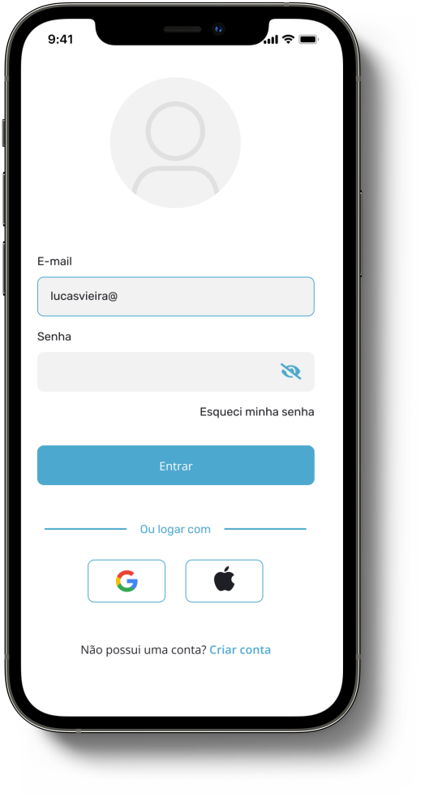

# Desenvolvimento dispositivos moveis

Tela de login criada no Figma. Posteriormente esta tela será implementada usando Flutter.

  

Link do projeto no figma. [Acesse aqui](https://www.figma.com/file/AQEQ33wK77UaplZ2QWleiH/Aula-Mobile?node-id=0%3A1&t=fYf7qAsEkpcFyKkJ-1)
